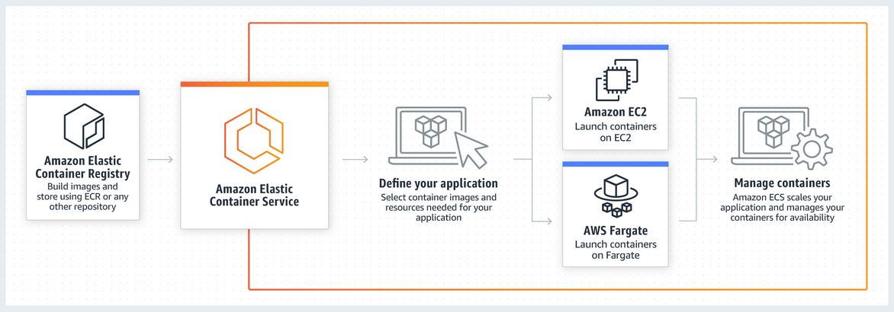

# ECS Lab

The goal of this exercise is to deploy your previously built Docker image automatically to the AWS Elastic Container Service : [ECS](https://aws.amazon.com/ecs/?nc1=h_ls).  

This diagram shows how ECS works :

---

- First, deploy an ECS cluster with CloudFormation from the following template (and add it to your repo): 
    - [ecs-cluster.yaml](./files/aws/ecs-cluster.yaml)
    - Choose the default Security Group, VPC and 2 Subnets.
       
        !!! tip
            You can find these info in the AWS console : **EC2** & **VPC** parts.   
            Parameters can be passed to the CF Stack using the `--parameter-overrides` option.   
            You may also need to use `--capabilities CAPABILITY_NAMED_IAM` in order to allow the stack to create the roles.

- Add the following file to your repository. Try to understand each part of it.
    - [ecs-task.yaml](./files/aws/ecs-task.yaml)
    

- Use the [TaskDefinition](https://docs.aws.amazon.com/AmazonECS/latest/developerguide/task_definitions.html) above to deploy your docker image in ECS

        aws cloudformation deploy --template-file ecs-task.yaml --stack-name ecs-task --parameter-overrides ImageUrl=docker.io/<your-docker-id>/yncrea-hellomicro:sha-$(git rev-parse --short HEAD) --no-fail-on-empty-changeset
        

- Use a web browser and try to access the EC2 running the container public URI on port 8080 !

    !!! tip
        You can find the URI by browsing the AWS Console to **EC2 Service** > Select you instance > Public DNS (IPv4)

    !!! success
        Congratulation, you deployed your Docker image in ECS and can access your API through the Web !  
        Next step for Production would be to have a LoadBalancer in front of this ...  
   
---
     
- Extend your Github flow accordingly.

    !!! success
        Congratulation, you are now able to Continuously Deliver Docker images !
        
---

## Followup Exercise

Checkout the two links below and modifiy your ECS cluster to be backed up by a Public Load Balancer & Target Group :

- [Cluster with LB](https://github.com/awslabs/aws-cloudformation-templates/blob/master/aws/services/ECS/EC2LaunchType/clusters/public-vpc.yml)
- [Service](https://github.com/awslabs/aws-cloudformation-templates/blob/master/aws/services/ECS/EC2LaunchType/services/public-service.yml)

Verify all is working fine by going to you Public Load Balancer URL (Public DNS Name) on port 8080.

!!! warning
    Be careful to update the templates to uses your **existing VPC, Subnets, Security Groups** etc ... instead of creating new ones as they do in the template !  
    
    Also, you need to add a LoadBalancer **Listener & Rule** on port 8080 to redirect calls to our micro service to the right **Target Group**.