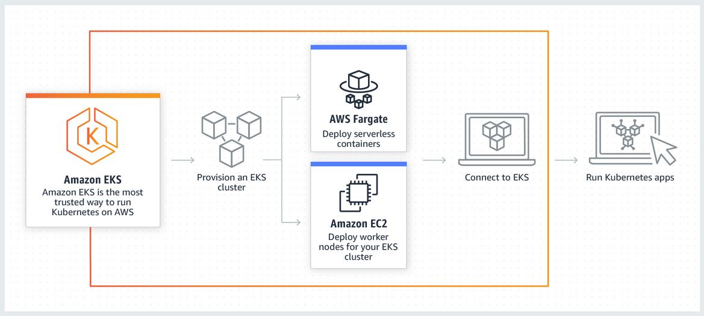

# EKS Lab


You have already experimented with a local Kubernetes installation in the form of Minikube.  
In the next step, we will set up a managed Kubernetes on AWS.  
For this, we will use **EKS**, the [Elastic Kubernetes Service](https://aws.amazon.com/eks/?nc1=h_ls).  

This diagram shows how EKS works :


---

## EKS Cluster Deployment

To facilitate the instantiation of Kubernetes, we will use {==eksctl==}, a command line tool interact with Kubernetes.  

To install it, please follow the guidelines [here](https://eksctl.io/introduction/#installation).

After the installation, please download the following file:

- [eks-cluster.yaml](files/eks/eks-cluster.yaml)  

!!! danger
    It is absolutely necessary that you use the file above for cluster definition.   
    The AWS Educate has certain limitations that makes the "standard" installation fail.

You can then instantiate an EKS cluster by simply executing the following command:

`eksctl create cluster -f src/infra/eks-cluster.yaml`

!!! tip
    You can use `--profile` same as in `aws` commands to specify a specific profile if you have several AWS Accounts.
    
---

## Configure Kubectl

Amazon EKS uses the aws eks get\-token command, available in version 1\.18\.49 or later of the AWS CLI or the [AWS IAM Authenticator for Kubernetes](https://github.com/kubernetes-sigs/aws-iam-authenticator) with kubectl for cluster authentication\. If you have installed the AWS CLI on your system, then by default the AWS IAM Authenticator for Kubernetes will use the same credentials that are returned with the following command:

```
aws sts get-caller-identity
```

1. Ensure that you have version 1\.18\.49 or later of the AWS CLI installed\. To install or upgrade the AWS CLI, see [Installing the AWS Command Line Interface](https://docs.aws.amazon.com/cli/latest/userguide/installing.html) in the *AWS Command Line Interface User Guide*\.

    !!! warning
        Your system's Python version must be 2\.7\.9 or later\.  
        Otherwise, you receive `hostname doesn't match` errors with AWS CLI calls to Amazon EKS\.


    You can check your AWS CLI version with the following command:
    
       ```
       aws --version
       ```

1. Use the AWS CLI `update-kubeconfig` command to create or update your kubeconfig for your cluster\.
   > By default, the resulting configuration file is created at the default kubeconfig path \(`.kube/config`\) in your home directory or merged with an existing kubeconfig at that location\. You can specify another path with the `--kubeconfig` option\.

       ```
       aws eks --region <region-code> update-kubeconfig --name <cluster_name>
       ```

1. Test your configuration\.

       ```
       kubectl get svc
       ```

       Output:
    
       ```
       NAME             TYPE        CLUSTER-IP   EXTERNAL-IP   PORT(S)   AGE
       svc/kubernetes   ClusterIP   10.100.0.1   <none>        443/TCP   1m
       ```

    !!! tip 
        If you receive the error `"aws-iam-authenticator": executable file not found in $PATH`, your kubectl isn't configured for Amazon EKS\.   
        For more information, see [Installing `aws-iam-authenticator`](https://github.com/awsdocs/amazon-eks-user-guide/blob/master/doc_source/install-aws-iam-authenticator.md).  

(More details & troubleshooting [here](https://github.com/awsdocs/amazon-eks-user-guide/blob/master/doc_source/create-kubeconfig.md))

---

## Chart deployment

1. Install Helm backend service
    - Tiller service account (Tiller is the Helm server-side component) :
        ````bash
        kubectl create serviceaccount tiller --namespace kube-system
        ````
    - Create the service-account.yaml file in your repo
        ````yaml
        apiVersion: v1
        kind: ServiceAccount
        metadata:
          name: tiller
          namespace: kube-system
        ````
       
    - Create the rbac-config.yaml file in your repo
        ````yaml
        kind: ClusterRoleBinding
        apiVersion: rbac.authorization.k8s.io/v1
        metadata:
          name: tiller-role-binding
        roleRef:
          kind: ClusterRole
          name: cluster-admin
          apiGroup: rbac.authorization.k8s.io
        subjects:
        - kind: ServiceAccount
          name: tiller
          namespace: kube-system
        ````
      
    - Run apply commands and helm init
     
        ````bash
        kubectl apply -f src/infra/service-account.yaml
      
        kubectl apply -f src/infra/rbac-config.yaml
        
        helm init --service-account tiller
        ````
      
    - We can see tiller-deploy is a running pod in kube-system namespace : 
    
        ````bash
        kubectl get pods --namespace kube-system | grep tiller
        tiller-deploy-758bcdc94f-4c77s   0/1     Pending   0          71s
        
        kubectl get pods --namespace kube-system | grep tiller
        tiller-deploy-758bcdc94f-4c77s   0/1     Running   0          92s
        ````
     
1. Deploy our Chart

    - Deploy the chart from previous Labs :
    
        ````bash 
        helm install --name silly-unicorn src/helm/chart/yncrea-hellomicro
        ````
      
        !!! note
            Helm CLI is using the same config file as Kubectl, nothing to change here to target EKS !
        
    - Check running pods / services :
    
        ````bash 
        kubectl.exe get pods
        NAME                                READY   STATUS    RESTARTS   AGE
        yncrea-hellomicro-646cb8c96-5g7td   1/1     Running   0          
      
        kubectl.exe get services
        NAME                        TYPE        CLUSTER-IP       EXTERNAL-IP   PORT(S)        AGE
        kubernetes                  ClusterIP   10.100.0.1       <none>        443/TCP        15m
        yncrea-hellomicro-service   NodePort    10.100.136.153   <none>        80:30080/TCP   51s
        ````
    
    - Add an `Inbound Rule` on the Security Group `eks-nodegroup` to allow TCP traffic from all IPs to your worker node on port `30080`.
    
    - Connect to your worker node EC2 instance public DNS Name on port `30080` and check your micro service is running fine.
    
        !!! success
            Congratulations ! You are able to deploy Chart in EKS !
            
---

## Github Action

After the cluster installation, it's time to extend your Github Actions workflow to launch the deployment in Kubernetes.


You'll need to extend your workflow with the following lines:

    aws eks --region <region-code> update-kubeconfig --name <cluster_name>
    
    helm upgrade --install silly-unicorn src/helm/chart/yncrea-hellomicro
    
!!! note
    We won't set up the EKS cluster creation in Github Actions as it is heavy and not useful to deploy / update at each commit.
    
    
!!! success
    Congratulations ! At this point you are able to build and test Docker Images (CI) and use them in a Helm Chart, automatically deployed on AWS EKS (CD) !
    
 ---
 
## Followup Exercise
 
 - Create a CF file to add the missing Application Load Balancer to your Infra, in order to access your micro service by a fixed DNS Name.
 
 - Analyze the file `cf-all.yaml` used in the Cloud Formation Linting chapter. Once you understand everything, deploy it to have your first app example using a Database !