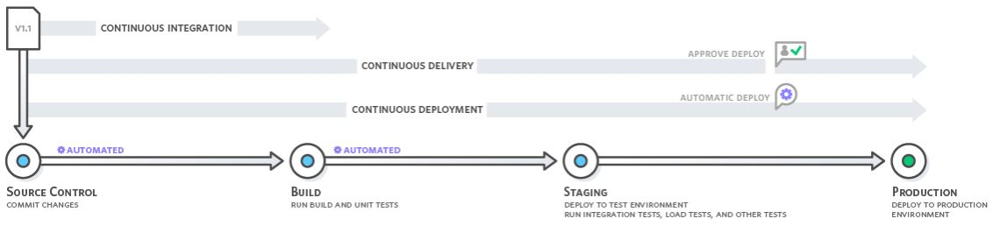

# Github Actions Lab - CI

The goal of this exercise is to show you how to create a **CI/CD Pipeline** for containerized applications.  
For this Lab, we will use the automation platform of Github, called *[Github Actions](https://help.github.com/en/actions/getting-started-with-github-actions)*.

At the end of the exercise, you should have added a Github Actions YAML file to your repository and on each commit and push to the master branch, a new Docker image should be built automatically, and pushed to dockerhub.

!!! danger
    Performing this lab is absolutely necessary for most of the following exercises.

---

## CI / CD ?

We always refer to the automatization of code source build and deployment with the terms CI/CD, for Continuous Integration and Continuous Deployment.
Several tools are able to help us automatize all the steps from the source code to the project running in production.

!!! warning 
    - Continuous **Integration** is automating the Build steps and the Testing part, to obtain a validated delivrable package.
    - CD can mean : Continuous **Delivery** or Continuous **Deployment**. The main difference is that Delivery means : we do not push to prod automatically.
    Here is a good sum up made by [AWS CI/CD teams](https://aws.amazon.com/devops/continuous-integration/?nc1=h_ls) 



---

## Basic Action

First, let's create a basic action, doing a simple Echo from Mona, the Octocat.

- Create the `.github/workflows` directory needed to use github actions.
- Create the file [`build.yaml`](./files/github/build.yaml) in here.

---

## Compile, Test & Package the Code

Since we already did the job in maven, the easiest is to reuse this in an `ubuntu` based action with Java enabled, and some `mvn` {==steps==}.

- Update the `build.yaml` file : make it clean, give proper names to steps, remove the basic step ...

    !!! tip
        `mvn` is embededd and configured in ubuntu:latest github-action container.
        
        Yet, `java` need to be configured :
        
        ````yaml
        ...
          - name: Set up JDK 1.8
            uses: actions/setup-java@v1
            with:
              java-version: 1.8
        ...
        ````
    
    !!! warning
        Don't forget to [checkout](https://github.com/actions/checkout) the code of your µS inside the github action container at the begining :wink: 
        
        Also, choose the most relevant trigger : On **push** ? On **pull request** ? On **which branch** ?

---

## Build & Push the Image

Let's simply use an [existing action provided by DockerHub](https://www.docker.com/blog/first-docker-github-action-is-here/).

- Login to dockerhub and create a repository for your image : 
`<your_docker_id>/cloudcomputing`   
- Update the file `build.yaml` again.
- Use the Github Action provided by Docker ([github link](https://github.com/marketplace/actions/build-and-push-docker-images))
- Push your image with a unique tag to *hub.docker.com* (use the GITHUB_SHA environment variable)
    
    !!! warning
        Don't forget to create your DockerHub credentials as [Github Secrets](https://help.github.com/en/actions/configuring-and-managing-workflows/creating-and-storing-encrypted-secrets) in your repo settings !!!

- Check your image has been pushed to your DockerHub Account Registry.

    !!! success
        Congratulation, your Docker image is ready to be used by anybody !
    
---

## Followup Exercise

!!! tip 
    You can setup a build notification on *#Slack* !
    [ voxmedia/github-action-slack-notify-build ](https://github.com/voxmedia/github-action-slack-notify-build).
    > Scopes used are :
    >
    > chat:write
    >
    > channels:read
    >
    > groups:read
    
!!! tip
    You can setup an online Documentation using [Github Pages](https://pages.github.com/) !
    
    > [Deploy MkDocs](https://github.com/marketplace/actions/deploy-mkdocs).