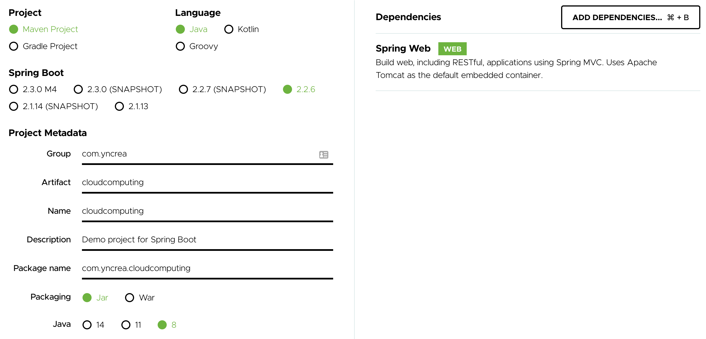

# SpringBoot Lab

The goal here is to create a sample micro service coded in [Java Spring Boot](https://spring.io/projects/spring-boot) built with Maven.

1. **Create** the micro service using [Spring Initializr](https://start.spring.io/) online tool.
    * Fill required fields as the image below
    !!! warning
        Don't forget to add "Spring Web" dependency !
        
    
    
    * Click on "Generate" to download the zipped sources.
    
    * Extract them in your work directory.
    
    * Import it in your favorite Java IDE as a __Maven__ project.
    
        !!! tip
            IntelliJ Idea Community Edition is a very good choice ... Just saying !
            
        !!! tip
            If you don't use IntelliJ and need to install Maven, here is the command :wink:
            ```bash linenums="1"
            choco install maven
            ```
            
1. **Edit** the code

    * Modify the main class :
    
        `src/main/java/com/yncrea/cloudcomputing/CloudcomputingApplication.java` 
        
        as below :
    
        ``` java hl_lines="9 13 14 15 16 17 19 20 21 22 23 25 26 27 28 29 30" linenums="1"
        package com.yncrea.cloudcomputing;
        
        import org.springframework.boot.SpringApplication;
        import org.springframework.boot.autoconfigure.SpringBootApplication;
        import org.springframework.web.bind.annotation.RequestMapping;
        import org.springframework.web.bind.annotation.ResponseBody;
        import org.springframework.web.bind.annotation.RestController;
        
        @RestController
        @SpringBootApplication
        public class CloudcomputingApplication {
        
            @RequestMapping("/")
            public String home() {
                String hostname = System.getenv("HOSTNAME");
                return "Hello Docker World - hostname : " + hostname;
            }
        
            @RequestMapping("/hello")
            @ResponseBody
            public String sayHello() {
                return "Hello " + System.getenv("GREETING");
            }
        
            @RequestMapping("/secret")
            @ResponseBody
            public String getSecret() {
                String secret = System.getenv("MY_SECRET") == null ? "" : System.getenv("MY_SECRET");
                return "Secret : " + secret;
            }
        
            public static void main(String[] args) {
                SpringApplication.run(CloudcomputingApplication.class, args);
            }
        
        }
       
        ```

1. **Test** it with the embedded Tomcat Server
    
    * Build the project using your IDE Maven Window
    
        or
        
        Using the command line :
        ``` bash linenums="1"
        mvn clean install
        ```

    * Run the application using your IDE Run Configuration
    
        or
        
        Using the command line :
        ``` bash linenums="1"
        mvn spring-boot:run
        ```
      
    * The application is now accessible at http://localhost:8080
    
        !!! tip
            Try visiting http://localhost:8080/hello to reach your 2nd API  :smirk: