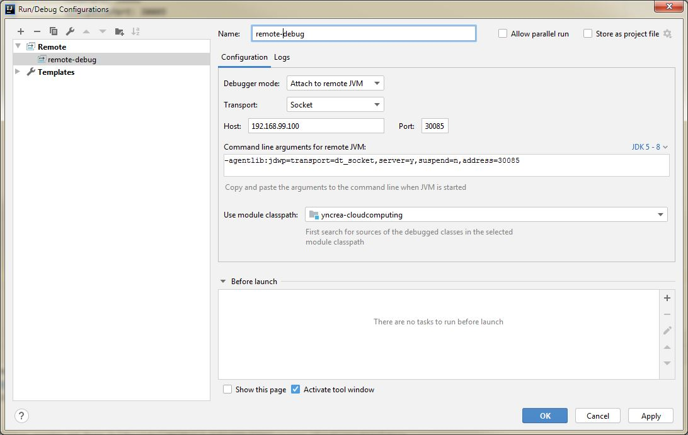

# Kubernetes Lab

We saw that Docker helps creating Containers. 
Now we need to manage these containers : here comes Kubernetes, the **"Container Orchestrator"**, also called *"K8S"*.

Please visit their [website](https://kubernetes.io/docs/concepts/overview/what-is-kubernetes/) explaining in details what is K8S ...

In this lab, we will use [Minikube](https://kubernetes.io/docs/setup/learning-environment/minikube/) as a local kubernetes, for develoment only.

!!! info
    No matter if you used _Gokube_ for previous Labs, it is running Minikube behind the scenes :wink:
    If you used _Docker Desktop_ you don't have Minikube but an embedded K8S Cluster working the same way, all good !
--- 

## Simple Application Deployment

1. Verify that you can access Kubernetes:  

		kubectl version

	If you see a `Server Version` like below, it means your Kubernetes CLI can connect to your Kubernetes VM:

		$ kubectl version
		Client Version: version.Info{Major:"1", Minor:"13", GitVersion:"v1.13.10", GitCommit:"37d169313237cb4ceb2cc4bef300f2ae3053c1a2", GitTreeState:"clean", BuildDate:"2019-08-19T10:52:43Z", GoVersion:"go1.11.13", Compiler:"gc", Platform:"linux/amd64"}
		Server Version: version.Info{Major:"1", Minor:"13", GitVersion:"v1.13.10", GitCommit:"37d169313237cb4ceb2cc4bef300f2ae3053c1a2", GitTreeState:"clean", BuildDate:"2019-08-19T10:44:49Z", GoVersion:"go1.11.13", Compiler:"gc", Platform:"linux/amd64"}


1. Create the folder `src/kubernetes` in your project.

1. Download the following file to your the newly created folder:  

    -  [deployment.yaml](./files/kubernetes/deployment.yaml)  

1. Open the file in an editor and verify that the `image:` key is referencing your previously built image.

1. Deploy your application with the following command:  

		kubectl apply -f src/kubernetes/deployment.yaml

1. Verify that your application is running properly:  

		kubectl get deployment

   	You shoud now see one running **Pod**, which is scheduled by the **Deployment** that you just created.
   	
   	!!! tip
   	    The number of pods (more specifically, the number of containers) running is displayed in the "READY" column.
   	    
   	    1/1 means 1 container is working fine out of 1 expected, all good :muscle: !
 
    !!! info
        Even if you have one pod running, if now try to access your application REST APIs through your browser, it should __NOT__ work.  
        (Unless you forgot to delete the docker container from previous Lab, in this case, the old container is repsonding, not the newly created pod !)

1. You can also check the running Pods in your Kubernetes cluster by typing:  

		kubectl get pods

	This will give a list of running instances (a.k.a. Pods) of your application.
	
	!!! tip
	    Write down the name of the Pod, you'll need it later for reference.

1. In order to _access_ your application, you have to deploy a Kubernetes __Service__.   
Download the following file to your *kubernetes* folder: 

    - [service.yaml](./files/kubernetes/service.yaml) 

    and apply the following command:    

		kubectl apply -f src/kubernetes/service.yaml

1. You have now deployed a so called **NodePort** Kubernetes **Service**. It opens a dedicated port on your Minikube VM, through which you can access the according service.  

    You can find the associated port number by typing:  

		kubectl get svc

    In the example below, the port number would be **30080**:

		$ kubectl get svc  
		
        NAME                        TYPE        CLUSTER-IP       EXTERNAL-IP   PORT(S)        AGE
        kubernetes                  ClusterIP   10.96.0.1        <none>        443/TCP        14d
        yncrea-hellomicro-service   NodePort    10.103.108.153   <none>        80:30080/TCP   2m15s


    !!! info
        If not set in the service, Kubernetes would allow a random NodePort between 30000 and 32767.
            
1. In your browser, open the IP of your Minikube VM (which you retrieved in the docker lab) and add the port that you retrieved from the last command, e.g.: 	[http://minikube-ip:30080](http://minikube-ip:30080).  
   
    !!! tip
        When using Docker Desktop embedded K8S in place of minikube, you can directly hit on [http://localhost:30080](http://localhost:30080) !
    !!! success
        You should see "Hello World" example from before, but it's hosted in Kubernetes :thumbsup:.  
        
        In addition you will notice that the micro service is now displaying the _hostname_.   
        Indeed, now the container is __orchestrated__ by kubernetes, and kubernetes filled the default env vars such as _HOSTNAME_ used in our microservice Java Code ;)

---

## Application Scaling

1. Now you'll see the scaling capabilities of Kubernetes. Enter the following command:  

		kubectl.exe scale deployment/yncrea-hellomicro --replicas=3

	With this command, you update the Kubernetes **Deployment** and instruct it to have a total of *three* replicas. 
	
	Kubernetes will handle that by instantiating *two* additional **Pods** to handle more workload.  
	
	You can easily check by doing `kubectl get pods`.  

1. Refresh your browser several times and monitor how the hostname of your microservice changes. 
    
    You may need to use `CTRL + F5`
    
    Kubernetes is loadbalancing your request for you ! 
 
    !!! success
        Congratulations, you just learned how to scale a service in Kubernetes !

---

## Application Config

1. For the next step, we we'll see how to configure an application in Kubernetes.  
   You might have noticed that in the main Java Class, we are referencing an environment variable `GREETING` with the default value _"You"_.  
   In a first step, we will change the Kubernetes deployment and modify the environment variable section the Pod template:  

		kubectl edit deployment yncrea-hellomicro

	Then modify the `GREETING` variable so the µS will greet yourself, and save.
	
	The deployement should be `Edited`.
	
	!!! warning
	    A K8S ressource edited with `kubectl edit` command is **temporary**. 
	    
	    The modification will be lost when deleting / re-deploying the app.  
	    
	    The modificatin __needs to be reported__ to the file `deployment.yaml` after you are satisfied with the result to make it permanent at each app deployment.

1. Refresh your browser, and see how to greeting changed.

1. Now let's use another mean to configure our application: the Kubernetes **ConfigMap**. Download the sample ConfigMap to your `src/kubernetes` folder:  

    - [configmap.yaml](./files/kubernetes/configmap.yaml)

    This way, you can decouple the application from the deployment configuration and therefore ease the reusability of your application. 
    
    You can deploy the ConfigMap with the following command:  

		kubectl apply -f src/kubernetes/configmap.yaml

1. Now, you'll have to modify your deployment in order to consume the ConfigMap:

		kubectl edit deployment yncrea-hellomicro

	And edit the file in the following way:

    ````yaml linenums="1" hl_lines="5 6 7 8"
        spec:
          containers:
          - env:
            - name: GREETING
              valueFrom:
                configMapKeyRef:
                  key: greeting
                  name: yncrea-hellomicro-configmap
    ````

1. Refresh your browser, and see how to greeting changed.

    !!! success
        Congratulations, you just learned how to configure an application in Kubernetes unsing Configmaps !

---

## Application Secrets

Kubernetes also supports objects of the type **Secret**, that are meant to store sensitive data. 

Secrets can either be injected as environment variables or mounted in the Pods filesystem.

As you already learned how to inject environment variables, let's now inject the Kubernetes secret as a file into our pod.

1. Deploy a secret in our Kubernetes cluster: 

		kubectl create secret generic yncrea-hellomicro-secret --from-literal=secret.txt="my very secret secret agent name"

    !!! tip
        You can also create Secrets from a [file](https://kubernetes.io/docs/concepts/configuration/secret/#creating-a-secret-manually).
        It will be usefull later to automatize our deployment.
    
1. Update your Pod definiton (deployment) to mount the _yncrea-hellomicro-secret_ secret in `/var/secret/` and to consume it :

		kubectl edit deployment yncrea-hellomicro

	And edit the file in the following way:

    ````yaml linenums="1" hl_lines="9 10 11 12 13 24 25 26 27 33 34 35 36"
    spec:
      containers:
      - env:
        - name: GREETING
          valueFrom:
            configMapKeyRef:
              key: greeting
              name: yncrea-hellomicro-configmap
        - name: MY_SECRET
          valueFrom:
            secretKeyRef:
              key: secret.txt
              name: yncrea-hellomicro-secret
        image: test/cloudcomputing:latest
        imagePullPolicy: IfNotPresent
        name: yncrea-hellomicro
        ports:
        - containerPort: 8080
          name: http
          protocol: TCP
        resources: {}
        terminationMessagePath: /dev/termination-log
        terminationMessagePolicy: File
        volumeMounts:
        - mountPath: /var/secret
          name: yncrea-hellomicro-secret
          readOnly: true
      dnsPolicy: ClusterFirst
      restartPolicy: Always
      schedulerName: default-scheduler
      securityContext: {}
      terminationGracePeriodSeconds: 30
      volumes:
      - name: yncrea-hellomicro-secret
        secret:
          secretName: yncrea-hellomicro-secret
    ````
   
1. Refresh your browser, and see how the _/secret_ API changed and is now displaying your decoded secret !

    !!! success
        Congratulations, you just learned how to configure an application in Kubernetes using Secrets !

---

## Cleanup

Before going to next steps, it is important to cleanup all this *** we created manually to not conflict with later all-in-one deployment with Charts.

```` shell
kubectl delete deployment yncrea-hellomicro
kubectl delete service yncrea-hellomicro-service
kubectl delete cm yncrea-hellomicro-configmap
kubectl delete secret yncrea-hellomicro-secret
````

---

## Helm Charts

To deploy our containers on kubernetes, we could create k8s objects and deploy them individually as above.


But why not creating a single {==release==} of our microservice deployment, nicely packaged with all the neeeded k8s objects ?
We would then be able to install, upgrade, delete ... any release of our µS, in one single command, with one single package :thinking_face: !

The solution is : **Helm Charts**. Have a look to their awesome [documentation](https://helm.sh/) :face_with_monocle: !

1. Create the Chart
    
    According to documentation, we may adopt the appropriate [structure](https://helm.sh/docs/topics/charts/#the-chart-file-structure).

    In our case we have a very simple deployment and we DON'T need :
    
    - The `charts` directory since we have no subcharts
    
    - The `crds` directory since we have no custom ressources
        
        !!! info
            You can create the `Optional` files (documentation mainly) if you want to.
    
    So let's proceed :
    
    - Create the folders `src/helm/chart/yncrea-hellomicro`.
    
        !!! warning
            The last folder **MUST** be named according to your Chart name ! (to define in the `Chart.yaml` file)
    
    - Inside, create the `templates` directory and move there the k8s objects we created previously :
        -   `deployment.yaml`
        -   `service.yaml`
        -   `configmap.yaml`
        
    - Put the file [secret.yaml](./files/kubernetes/secret.yaml) in your Chart's templates directory along side other files.
    
        !!! info
            This is the secret we created manually before, now provisionned as a k8s ressource file for automation purpose !

    - Edit the `deployment.yaml` file (if not done already) to report the changes done previously (when we used `kubectl edit` commands) to get the env variables from the Configmap and the Secret.
    
    - In the `Chart` folder (`src/helm/chart/yncrea-hellomicro`), download and put :
        -   [Chart.yaml](./files/kubernetes/Chart.yaml)
        -   [values.yaml](./files/kubernetes/values.yaml)
        
        !!! info
            `Chart.yaml` is the declaration of your Chart
            
            `values.yaml` is the file meant to configure your Chart
        
    - Use the values defined in `values.yaml` to configure your Chart.
    
        ??? example "Solution for `deployment.yaml`"
            ````yaml linenums="1" hl_lines="9 20"
            apiVersion: apps/v1
            kind: Deployment
            metadata:
              name: yncrea-hellomicro
              labels:
                app.kubernetes.io/name: yncrea-hellomicro
            
            spec:
              replicas: {{ .Values.replicaCount }}
              selector:
                matchLabels:
                  app.kubernetes.io/name: yncrea-hellomicro
              template:
                metadata:
                  labels:
                    app.kubernetes.io/name: yncrea-hellomicro
                spec:
                  containers:
                    - name: yncrea-hellomicro
                      image: {{ .Values.image.repository }}:{{ .Values.image.version }}
                      imagePullPolicy: IfNotPresent
                      ports:
                        - name: http
                          containerPort: 8080
                          protocol: TCP
            ````

        ??? example "Solution for `service.yaml`"
            ````yaml linenums="1" hl_lines="12 13"
            apiVersion: v1
            kind: Service
            metadata:
              name: yncrea-hellomicro-service
            spec:
              selector:
                app.kubernetes.io/name: yncrea-hellomicro
              ports:
                - protocol: TCP
                  port: 80
                  targetPort: 8080
                  nodePort: {{ .Values.service.nodePort }}
              type: {{ .Values.service.type }}
            ````

1. Deploy the Chart to Minikube using Helm

    Simply use the Helm CLI to deploy the Chart :
    
        helm install silly-unicorn src/helm/chart/yncrea-hellomicro
        
    !!! note
        We fix the name of the release ( `silly-unicorn` ) in order to be able to upgrade/delete it automatically. 
        
        Otherwise, Helm would assign a random name.
        
    Verify your Chart deployed properly the µS (its {==deployment==}, {==pods==}, {==configmap==}, {==secret==} and {==service==}). 
    
    Check everything is working as expected by accessing your REST APIs (`/`, `/hello`, `/secret`) in your browser as done before.
    
    !!! success
        Congratulation, you deployed your fisrt Chart (or Application) using Helm !

1. Upgrade the release

    At this moment, we have our Chart ready, our app is running.
    
    But what if we want to update it ?
    
    Let's do a change in the code and add a new API `/new` returning a String "Hello from New API"  
    
    - Rebuild your project to publish your new release.
    
    - Then try {==upgrading==} your application using :
    
        ````bash
        helm upgrade silly-unicorn src/helm/chart/yncrea-hellomicro
        ````
         
    - Check the `/new` API is there and returning expected value.
    
        !!! success
            Congratulation, you upgraded your first application using Helm !
            
---

## Deploying automatically with Maven :

**Automatize the build** using Maven Helm plugin :

1. **Find** the latest Helm plugin online
 
    Add the dependency to you pom.

    ??? example "Solution"
        ````xml
		<dependency>
			<groupId>com.kiwigrid</groupId>
			<artifactId>helm-maven-plugin</artifactId>
			<version>5.4</version>
		</dependency>
        ````

1. **Configure** the plugin to :
    - **Verify** the Chart in the {==test==} phase using the {==lint==} goal
    - **Package** the Chart into an archive in the {==package==} phase, using the {==package==} goal.

        ??? example "Solution"
            ````xml linenums="1" hl_lines="18 20 25 27"
                <build>
                    <plugins>
                        ...
                        <plugin>
                            <groupId>com.kiwigrid</groupId>
                            <artifactId>helm-maven-plugin</artifactId>
                            <version>5.4</version>
                            <configuration>
                                <chartDirectory>${project.basedir}/src/helm/chart/yncrea-hellomicro</chartDirectory>
                                <chartVersion>${project.version}</chartVersion>
                                <outputDirectory>${project.build.directory}</outputDirectory>
                                <!-- This is the related section to use local binary with auto-detection enabled. -->
                                <useLocalHelmBinary>true</useLocalHelmBinary>
                            </configuration>
                            <executions>
                                <execution>
                                    <id>helm-lint</id>
                                    <phase>test</phase>
                                    <goals>
                                        <goal>lint</goal>
                                    </goals>
                                </execution>
                                <execution>
                                    <id>helm-package</id>
                                    <phase>package</phase>
                                    <goals>
                                        <goal>package</goal>
                                    </goals>
                                </execution>
                            </executions>
                        </plugin>
                    </plugins>
                </build>
            ````

1. Finally use a third plugin : `exec-maven-plugin` in order to (in the maven `pre-integration-test` phase):
    
    - Delete the fixed-name release `silly-unicorn` if it exists.
    - Deploy the new release with the same name, of the Chart we just built 
    
        ??? example "Solution"
            ````xml linenums="1" hl_lines="11 21 26 32"
            	<build>
            		<plugins>
            		    ...
                        <plugin>
                            <groupId>org.codehaus.mojo</groupId>
                            <artifactId>exec-maven-plugin</artifactId>
                            <version>${exec-maven-plugin.version}</version>
                            <executions>
                                <execution>
                                    <id>exec-helm-delete</id>
                                    <phase>pre-integration-test</phase>
                                    <configuration>
                                        <executable>helm</executable>
                                        <commandlineArgs>delete silly-unicorn --purge</commandlineArgs>
                                        <successCodes>
                                            <successCode>0</successCode>
                                            <successCode>1</successCode>
                                        </successCodes>
                                    </configuration>
                                    <goals>
                                        <goal>exec</goal>
                                    </goals>
                                </execution>
                                <execution>
                                    <id>exec-helm-install</id>
                                    <phase>pre-integration-test</phase>
                                    <configuration>
                                        <executable>helm</executable>
                                        <commandlineArgs>install ${project.build.directory}/${project.artifactId}-${project.version}.tgz --name silly-unicorn --wait --debug</commandlineArgs>
                                    </configuration>
                                    <goals>
                                        <goal>exec</goal>
                                    </goals>
                                </execution>
                            </executions>
                        </plugin>
            		</plugins>
            	</build>
            ````
 
1. Last step, test the whole Docker + Helm chart build and deploy using maven :smiley: !  

    ```shell
    mvn clean install
    ```
    It will create the docker image, push it to minikube registry. Then it will build the Helm chart, and install it to minikube, using the just pushed docker image.
    
    * Access your application REST APIs with your browser.
    
        Example : <http://192.168.99.100:30080/hello>

    !!! success
        Congratulation, you can now do any code change on the application java code or the chart config, 
        you just have to execute a `mvn clean install` command to build and redeploy your latest app version automatically !
---

## Remote Debug

In order to develop efficiently, remote debug is a must have.

1. First we need to update our `Dockerfile` to bootstrap a remote debug port (8000).

    ````Dockerfile hl_lines="5"
    FROM java:8
    EXPOSE 8080
    ARG JAR_FILE=target/*.jar
    COPY ${JAR_FILE} app.jar
    ENTRYPOINT ["java", "-agentlib:jdwp=transport=dt_socket,address=8000,server=y,suspend=n","-jar","/app.jar"]
    ````
   
    !!! warning
        Don't forget to rebuild your Docker Image and to push it again to your local registry (or DockerHub).
       
1. Then we need to expose this port by modifying the `deployment.yaml`

    ````yaml hl_lines="6 7 8"
        ...
             ports:
               - name: http
                 containerPort: 8080
                 protocol: TCP
               - name: remote-debug
                 containerPort: 8000
                 protocol: TCP
    ````
   
1. And finally create a `NodePort` in the `service.yaml` to make the debug port available from outside the K8S Cluster

    !!! tip
        A good practice is to make this `NodePort` configurable through the `values.yaml`
        
    ````yaml hl_lines="5"
    #values.yaml
    service:
      type: NodePort
      nodePort: 30080
      debugNodePort: 30085
    ````
   
    ````yaml hl_lines="8 9 10 11 12"
     #service.yaml
     ports:
       - name: http
         protocol: TCP
         port: 80
         targetPort: 8080
         nodePort: {{ .Values.service.nodePort }}
       - name: remote-debug
         protocol: TCP
         port: 8000
         targetPort: 8000
         nodePort: {{ .Values.service.debugNodePort }}
    ````
 
1. We can now update your Chart with the latest docker image and changes.

1. Let's create a remote debug configuration in IntelliJ Idea, targetting our remote debug NodePort :

    
    
    
1. Try run this remote debug configuration, place a breakpoint in the Java Code of the `/hello` API Method.  
Call the REST API using your browser and observe the execution stopping at your breakpoint.

    !!! success
        Congratulation, you can now deploy Helm Charts in Kubenretes & remote debug your Java Applications !