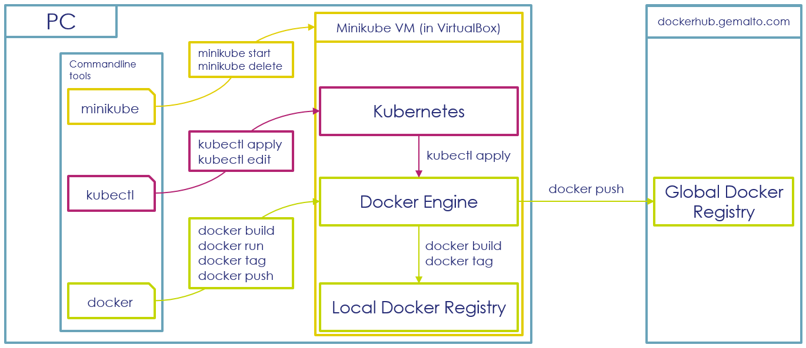

# Prerequisites

Please follow the instructions on this page {==carefully==}, as they will help you avoiding obstacles in the next exercices.  

The goal of the prerequisite step is to provide you a fully working development environment, containing Docker and Kubernetes.

---

!!! tip
    If you are using Windows 10 or Mac, you can also use [Docker Desktop](https://www.docker.com/products/docker-desktop) in place of minikube.

In order to achieve that, you'll be guided through the following steps:

* Create a [Github Account](https://github.com/join?source=header-home) if you don't already have one

* Create a [Docker Hub](https://hub.docker.com/signup) Account if you don't already have one 

* Install Chocolatey, a Package Manager for Windows

* With Chocolatey, you will install the following packages on your workstation:  
    - VirtualBox, a VM Manager
    - Docker CLI and Kubernetes CLI
    - Minikube, a tool that helps you installing a Docker and Kubernetes Development environment
    - AWS CLI, you'll need it later in the course
    
* With Minikube, you will install a Virtual Machine in VirtualBox, containing Docker and Kubernetes

The diagram on the bottom of this page is designed to help you to understand how Windows, your VM, Docker and Kubernetes are interacting.

---

**To perform this lab:**

1. **Install Chocolatey:** 
   
    According to the instructions [here](https://chocolatey.org/install). 
    You do not have to enter your email address in the first step. 
    
1. **Install needed Tools:**

    Launch a terminal (CMD, PowerShell or GitBash etc ...) with Windows Administrator rights and install VirtualBox, Python, Minikube, Kubectl (the Kubernetes CLI), Helm and the Docker CLI with the help of Chocolatey:
    
    !!! warning
        Please remove the items you arleady have in the command below, no need to reinstall them.
   
    Install Docker using Chocolatey according to your Windows Version :
    
    - Windows 10 with Hyper-V : 
       ```bash 
       choco install -y python awscli docker-desktop kubernetes-helm
       ```
      
    - Windows 7, 8, 10 Without Hyper-V : Use [Gokube](https://github.com/ThalesGroup/gokube)
       ```bash
       choco install -y python awscli virtualbox kubernetes-helm
       gokube init
       ```
    
    - Mac OS : Install [Docker Desktop](https://docs.docker.com/docker-for-mac/install/) and enable [Kubernetes](https://docs.docker.com/docker-for-windows/#kubernetes)
    
    - Linux : Install manually [Docker](https://docs.docker.com/engine/install/#server) + Helm + Kubernetes Cli + AWS Cli + Python
       
1. **Launch Gokube or Minikube depending on your case (If not using Docker Desktop):**

    !!! warning
        If your are not using ISEN Network, DO NOT set the proxy settings.
                     
    ```bash
    minikube --docker-env HTTP_PROXY="http://<isen-proxy-host>:<isen-proxy-port>" --docker-env HTTPS_PROXY="http://<isen-proxy-host>:<isen-proxy-port>" --docker-env NO_PROXY="127.0.0.1,192.168.99.0/24,10.0.0.0/8" start
    ```
   
    or
    
    ```bash
    gokube init --http-proxy "http://<isen-proxy-host>:<isen-proxy-port>" --https-proxy "http://<isen-proxy-host>:<isen-proxy-port>" --no-proxy "127.0.0.1,192.168.99.0/24,10.0.0.0/8"
    ```

    !!! info
        As we are in a universtiy network, we need to configure docker engine in the virtual machine to perform outgoing internet connection through this proxy.
        
        Certain hosts do not need to be accessed through the proxy, which is configured through the "NO_PROXY" parameter. In our case, this is:
        
         - localhost (127.0.0.1)
         - the network between your local VMs (192.168.99.0/24), 
         - the network range normally used for intranet (10.0.0.0/8)

    In order for Minikube to download the according VM image, you may have to configure the proxy on your workstation as well:  

    -   For Windows Terminal:  
            
            #!/usr/bin/bash
            set HTTP_PROXY=http://<isen-proxy-host>:<isen-proxy-port>
            set HTTPS_PROXY=http://<isen-proxy-host>:<isen-proxy-port>
            set NO_PROXY=127.0.0.1,192.168.99.0/24,10.0.0.0/8

    - For Shell (Cygwin, Git Bash):  

            #!/usr/bin/bash
            export HTTP_PROXY=http://<isen-proxy-host>:<isen-proxy-port>
            export HTTPS_PROXY=http://<isen-proxy-host>:<isen-proxy-port>
            export NO_PROXY=127.0.0.1,192.168.99.0/24,10.0.0.0/8


    >  You can now take a :coffee: waiting for everything to be ready !


1. **Configure CLI (If NOT using Docker Desktop):**
 
    After Minikube is launched, it can be necessary to configure your Docker CLI and Kubernetes CLI on your workstation.  
    This configuration is done through environment variables, which can be set with the following commands :
         
    !!! danger
        This has to be done every time you open a new terminal

    - For Windows Terminal:  

            @FOR /f "tokens=*" %i IN ('minikube docker-env') DO @%i

    - For Shell (Cygwin, Git Bash):  
            ```bash
            eval(minikube docker-env)
            ```
        or
            ```bash
            eval $(minikube docker-env)
            ```
        It will set following variables :
          ```bash
          export DOCKER_TLS_VERIFY="1"
          export DOCKER_HOST="tcp://192.168.99.100:2376"
          export DOCKER_CERT_PATH="/Users/jberger/.minikube/certs"
          export MINIKUBE_ACTIVE_DOCKERD="minikube"
          ```
    
           > This step allows Docker CLI and Kubernetes CLI to target the daemons inside the Minikube VM.
           > If you don't do this, your docker image will be pushed to your local Docker Registry, 
           > and the Kubernetes Cluster on the Minikube VM won't be able to access it !
        
           > To go back to the default config if needed, you can run :                                                                                                                                                                                                                                                                                                                                                                                                                                                                                                                                                                                                                                                                                                                                                                                                 
             ```bash
             eval "$(docker-machine env -u)"
             ```

1. **Verify that you can access the Docker CLI:**

        docker info

1. **Verify that you can access the Kubernetes CLI:**

        kubectl version

1. **Once satisfied with your configuration, make it permanent and system wide :**

    - On Shell by editing your *.bashrc* file and sourcing it
    - On Windows by settings the environement variables manually.

    It will be mandatory later when we will use Maven to automate the build.
          ```bash
           export DOCKER_TLS_VERIFY="1"
           export DOCKER_HOST="tcp://192.168.99.100:2376"
           export DOCKER_CERT_PATH="/Users/jberger/.minikube/certs"
           export MINIKUBE_ACTIVE_DOCKERD="minikube"
          ```
    !!! tip
        While using an IDE, you may have to restart it for these changes to take effect ...

    !!! info
        Again, to go back to default config, you'll have to unset the variables (or remove them on Windows) :
        ```bash
         unset DOCKER_TLS_VERIFY
         unset DOCKER_HOST
         unset DOCKER_CERT_PATH
         unset DOCKER_MACHINE_NAME
        ```

---

Below you can see a diagram of your workstation setup, which should help you understanding how the different components are interacting:  

